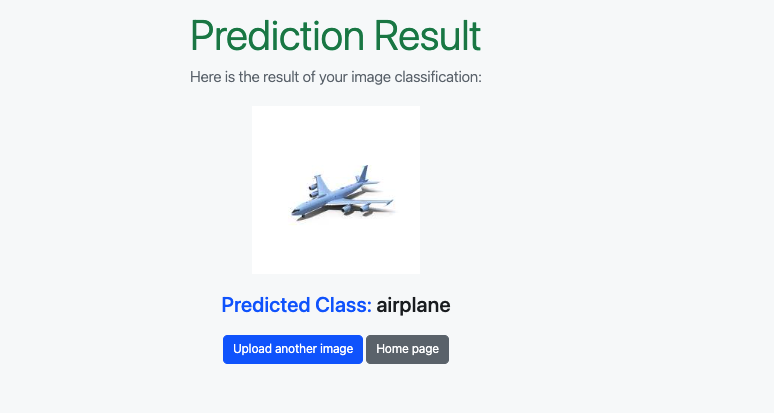

# Summary Report

## Model Selection:
The VGG16 pre-trained model was chosen due to its proven performance in image classification tasks and its training on the large ImageNet dataset. This made it a suitable choice for transfer learning, especially considering the baseline model's low accuracy of 10%.

## Reasoning:
The baseline model, trained on a smaller dataset, showed poor performance. VGG16's pre-trained weights, learned from a vast and diverse dataset, provided a strong foundation for feature extraction, which was expected to improve model performance significantly.

## Outcome:
VGG16 because, the model can benefit from faster convergence, reduced training time, and improved accuracy, as it taps into the knowledge gained from ImageNet's large dataset. This decision came about as result to enhance model performance and address the shortcomings of the baseline model.

## Note 
When I uploaded an airplane image the model was able to predict it airlane 

